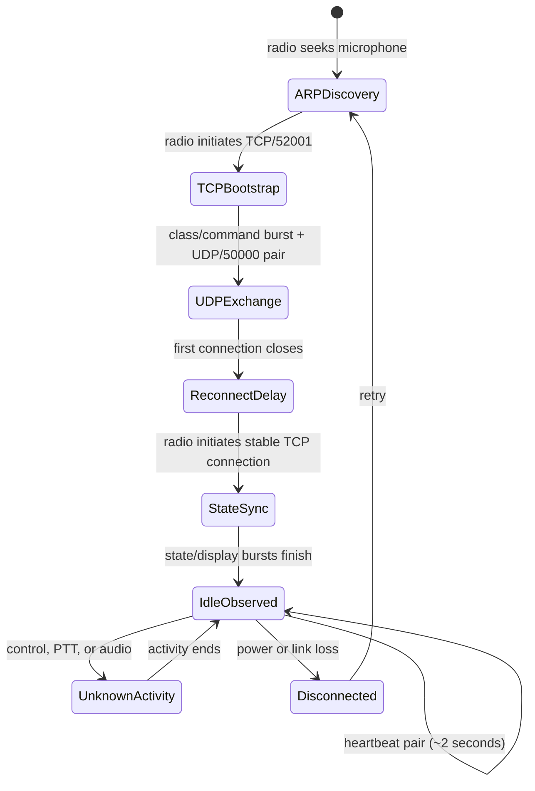

# CommandMic Ethernet protocol specification (working draft)

Status: working normative specification, updated through evidence E-094 and the
v1 library/API/dissector audit of 2026-08-20. “Verified” means directly observed and
reproduced; unknown command semantics are preserved and never promoted merely
because a software endpoint can replay them.

The wire specification is language-independent. The Python `ip-commandmic`
package is its reference implementation, not the definition of the protocol.
Public endpoint and lossless wire APIs are documented in
[`CONTROLS_API.md`](CONTROLS_API.md); application boundaries are documented in
[`ARCHITECTURE.md`](ARCHITECTURE.md).

## Transport

| Property | Value | Status |
|---|---:|---|
| Radio IPv4 | `192.168.0.1` | Verified for this configuration |
| Microphone IPv4 | `192.168.0.2` | Verified for this configuration |
| Persistent transport | TCP `52001` ↔ `52001` | Verified |
| TCP initiator | Radio | Verified in simultaneous cold boot |
| Voice transport | RTP/UDP `50000` ↔ `50000` | Verified by RTP headers/counters and F1 Monitor receive audio |
| Receive audio encoding | Signed 16-bit big-endian PCM, 8 kHz mono | Verified with calibrated 1 kHz FM stimulus |
| Transmit audio encoding | Signed 16-bit big-endian PCM, 8 kHz mono | Verified with acoustic 1 kHz microphone stimulus |

## TCP framing

The two verified idle messages are:

```text
radio -> mic  f3 41 71 05 00 00 02 4d 00 35 70 fd
mic -> radio  f3 41 71 05 00 00 02 6d 01 35 a8 fd
offset        00 01 02 03 04 05 06 07 08 09 10 11
```

Ordinary frames have this decoded layout:

| Logical bytes | Interpretation | Confidence |
|---|---|---|
| `0 = f3/f5` | Start/channel byte | High |
| `1..2 = 41 71` | Fixed signature | High |
| `3` | Message class | Structure verified; semantics generally unknown |
| `4` | Command | Structure verified; heartbeat mapped |
| `5..6` | Big-endian decoded payload length | High |
| `7..N` | Decoded payload | High |
| next 2 | CRC-16/Modbus, big-endian | High; every captured frame validates |
| final `fd` | Terminator | High |

The CRC uses reflected polynomial `0xa001`, initial value `0xffff`, no final
XOR, and covers logical byte 1 through the end of the payload. Unlike normal
Modbus wire order, the result is serialized most-significant byte first.

Inside a frame, each logical `f0..ff` byte is stuffed as `ff 00..0f`.
For example, logical `ff` becomes `ff 0f`, logical `f1` becomes `ff 01`, and
logical `fd` becomes `ff 0d`. Start and terminator bytes remain literal. Payload
length and CRC are evaluated after unstuffing.

Two 10-byte `f5 41 71 ee ... fd` messages have valid CRCs but do not use the
ordinary length layout. They are preserved as `special_or_unknown` pending
differential evidence.

See [MESSAGE_CATALOG.md](MESSAGE_CATALOG.md) for observed startup messages.

## Verified typed message families

This table is the normative cross-reference for the stable wire composers. The
reference implementation, synthetic `tests/fixtures/typed_messages.json`
corpus and Wireshark dissector use the same directions, values and names.

| Public composer | Direction | Wire family | Accepted semantic values |
|---|---|---|---|
| `encode_key_state`; `encode_key_tap` | Mic → radio | `01/01` | 23 ordinary keys; gated Emergency; press/release/neutral |
| `encode_ptt_state` | Mic → radio | `01/00` | press=`01`, release=`00` |
| `encode_power_state` | Mic → radio | `01/09` | press=`01`, release=`00` |
| `encode_display_transaction` | Radio → mic | `02/07` → `02/0a` → `02/08` | before=`02`, exact 68-byte buffer, after=`0044` |
| `encode_status_led` | Radio → mic | `02/02` | off=`00`, red=`02`, green=`04`, orange=`06` |
| `encode_backlight_state` | Radio → mic | `02/0b` | off=`00`, dim=`01`, on=`02` |
| `encode_mic_gain_transaction` | Radio → mic | `02/0e` × 2 | level `N`, then `N+1`, for `N=1..5` |
| `encode_audio_path` | Radio → mic | `01/04` | closed=`00000000`, receive-open=`01000000`, transmit-active=`08000000` |

`encode_message` is the lossless round-trip operation rather than a semantic
composer. `build_frame` is the expert primitive and does not assign meaning to
arbitrary class/command values. The `02/02` family is named `audio_status` in
the decoded model because it correlates with RX/TX state; its exact red/green
emitter mapping also makes it the verified status-LED composer.

## RTP/UDP voice transport

Each observed datagram contains a 12-byte RTP header and 320 payload bytes:

```text
80 | 7d | sequence (16-bit BE) | timestamp (32-bit BE) | SSRC (32-bit BE) | 320-byte payload
```

`80` identifies RTP version 2 with no padding, extension, or CSRC entries. `7d`
is dynamic payload type 125 with the marker bit clear. During receive audio the
radio SSRC is `b1947ef9`; the microphone's boot RTP SSRC is `7069c2cc`. The
earlier ten-byte “endpoint identifier” hypothesis is withdrawn: those bytes are
the standard RTP sequence, timestamp, and SSRC fields.

F1 Monitor produced radio-to-microphone packets at 20 ms cadence. Sequence
increased by 1 and timestamp increased by 160 for every packet. A 320-byte
payload therefore represents 160 16-bit samples on an 8 kHz RTP clock: signed
16-bit big-endian, mono PCM. On the receiver-noise fixture, big-endian decoding
gave mean -0.02, RMS 53.57, and peak 194; little-endian interpretation gave an
implausible RMS 13,279 and peak 32,768. A calibrated 300 Hz/1 kHz/2.5 kHz tone
trial subsequently measured 999.856 Hz from a calibrated 1 kHz FM stimulus,
promoting the receive codec to verified.

The reverse direction uses the same representation. During a dummy-load PTT
trial with an acoustic 1 kHz tone beside the CommandMic, 441 mic-to-radio RTP
packets contained 70,560 samples (8.82 seconds). Big-endian 8 kHz decoding
measured exactly 1000.0 Hz by positive-going zero crossings after trimming the
first and last 0.5 seconds. The stream had no RTP sequence discontinuities,
timestamps advanced by exactly 160, RMS level was -39.33 dBFS, peak was
-32.63 dBFS, and no samples clipped. This independently verifies the transmit
codec as signed 16-bit big-endian PCM, 8 kHz mono.

The software CommandMic now reproduces that transmit path against the real
radio. After `01/00:01`, it waits for the verified radio
`01/04:08000000` TX-active acknowledgement and begins RTP 30 ms after PTT.
The initial RTP header continues the captured mic boot packet exactly:
sequence `08f1→08f2`, timestamp `4d5a659c→4d5a663c`, SSRC `7069c2cc`.
PTT release is `01/00:00`; RTP continues for the observed approximately 210 ms
tail before the radio reports idle/closed approximately 222 ms after release.
The reference sender uses an absolute high-resolution 20 ms clock and forbids
compressed catch-up bursts after a late packet.

Radio-side applications that turn a completed microphone capture around into
speaker audio must synchronize to actual capture completion, not only the
nominal 222 ms control-close timing. In the alpha.21 physical-mic audit, a
speaker-open frame sent on a fixed 225 ms timer was followed by the still-pending
TX `01/04:00000000` close frame, which immediately closed the new speaker path
while RTP continued. The capture layer intentionally retains a 350 ms receive
tail; the reference endpoint now waits for that completion event before opening
the speaker transaction. This audit confirms an ordering requirement already
implied by the verified bidirectional gate state machine; it does not assign new
wire semantics.

The installed CS-F5330D help and application data model explicitly call the two
configurable network values **Control Port** and **Voice Port**, with the latter
restricted to even numbers. This agrees with the packet evidence that UDP/50000
is voice and TCP/52001 is control. The proprietary application/help material
and its private reference notes are not distributed with this project.

## Connection state and timing



### Simultaneous cold-boot timeline

- `0–18.0 s`: pre-existing idle TCP session.
- `39.787 s`: radio begins ARP requests for the microphone.
- `49.947 s`: microphone answers ARP; radio initiates TCP/52001.
- `49.948–49.978 s`: first bootstrap connection and UDP pair, then clean FIN.
- `52.392–59.852 s`: radio resumes ARP and initiates the stable connection.
- `59.854–60.887 s`: repeated bootstrap followed by state/display bursts.
- Thereafter: the normal two-second heartbeat exchange.
- `175.352 s`: radio closes and retries SYN without a response. Whether this was
  operator power removal or endpoint behavior is unresolved.

The radio emitted multiple SYNs with different initial sequence numbers during
the first attempt; one was reset by the microphone before another completed.
The stable connection unambiguously used radio SYN → microphone SYN/ACK → radio
ACK.

The reference implementation first binds the captured radio-side source ports
for both probe and stable connections. An immediate process restart can leave
the prior TCP four-tuple retained even with `SO_REUSEADDR` on some hosts. If
the OS rejects that bind as an address collision, the implementation records a
`source_port_fallback` audit event and retries from an ephemeral source port.
This is an implementation recovery policy, not evidence that the physical
radio normally varies its source port or that a different port has been
accepted by physical hardware.

Do not synthesize control, PTT, emergency, cloning, firmware, or audio messages
until corresponding one-variable experiments give them repeatable semantics.

## Evidence ledger

| ID | Observation | Source | Confidence |
|---|---|---|---|
| E-001 | TCP/52001 bidirectional idle session | 15-second passive summary | High |
| E-002 | Exact radio heartbeat bytes and ~2 s interval | Passive payload sample | High |
| E-003 | Exact microphone heartbeat response | Passive payload sample | High |
| E-004 | Ordinary layout, byte stuffing, and CRC algorithm | Cold-boot corpus; 184/184 CRCs | High |
| E-005 | 10-minute idle: 300 pairs, no unexplained bytes or drops | `20260809T033906Z_idle_10m.pcapng`, SHA-256 `cd5906ce5523e0cf8ffbb714b820c7b3b43b23330c0cb4376d89ab2373327303` | High |
| E-006 | TCP initiator, UDP/50000, two-stage bootstrap, and message catalogue | `20260809T040202Z_cold_boot_both.pcapng`, SHA-256 `e50972874f58f898982793f9a04627174afe68b680255776d6c7861883bcf4a9` | High |
| E-007 | Volume Up is `01/01:10` press and `:90` release; three trials reproduce `10 → 90 → 7f` | `20260809T043336Z_volume_up_press_r01.pcapng`, SHA-256 `2205927a837ffe6c680d33edc244eca7f2abe942443f546665dfc66cea7f83a3`; `20260809T050047Z_volume_up_press_r02.pcapng`, SHA-256 `81601dd02eef8d2b175721b384cada8f193b9b1d5f913b6adb486e16f7977785`; `20260809T050522Z_volume_up_press_r03.pcapng`, SHA-256 `4cbb93f47a4bd59c51d7d475ff3d1e2836beb079a16bcddc69d25412c0c71df2` | High; three-trial threshold met |
| E-008 | Volume Down is `01/01:01` press and `:81` release; three trials reproduce `01 → 81 → 7f` | `20260809T043647Z_volume_down_press_r01.pcapng`, SHA-256 `903a2cb81af61174627207e037f60f50e7229f34bc176890b422c91d863573c8`; `20260809T050314Z_volume_down_press_r02.pcapng`, SHA-256 `40a50845a8596b1e39cd4bfaf6fea051f77db72c0ce2c036ce8f976c5785f072`; `20260809T050710Z_volume_down_press_r03.pcapng`, SHA-256 `bbaa5e08394fb08d4be0e90013db6e173b8b1925d0fa9dbf416aed5bfcc07c2c` | High; three-trial threshold met |
| E-009 | Programming software defines separate Control and even-numbered Voice ports | CS-F5330D 1.5.0.35 help topic 62500 and `NetworkSettings` model | High |
| E-010 | P1–P4 press codes are `02/12/22/32`; release sets bit 7; all end in `7f` | `20260809T052135Z_button_map_p1_p2_p3_p4.pcapng`, SHA-256 `b441df1ce51048423581cbc3c2b747c4dd89ce0e3681cd158f322e7d7fb088e1` | High; 3/3 each |
| E-011 | Up/Down/Left/Right press codes are `20/21/31/30`; release sets bit 7; all end in `7f` | `20260809T052224Z_button_map_up_down_left_right.pcapng`, SHA-256 `d268ea72115185a28f7ed4cfdfee2ca4be98027d184d95e7fd31254c7f3a368c` | High for physical identity; 3/3 each |
| E-012 | Automated F2/F3 run reproduces Volume Up `10/90` and Volume Down `01/81`, ending in `7f` | `20260809T052839Z_button_map_f2_f3.pcapng`, SHA-256 `b83c02b49d11e82cc650ea6e8f3beb6e648a0defae35b9ef84f63e62148741b7` | High; 3/3 each |
| E-013 | F1 physical code is `00` press, `80` release, then `7f`; 3/3 trials | `20260809T053624Z_button_map_f1.pcapng`, SHA-256 `d54649f28781300364350eee705f947fa00aeec1c8983ea3dfb6033de6a8b847` | High |
| E-014 | UDP/50000 is RTP v2/PT125; RX packets carry 320-byte s16be/8 kHz mono PCM candidates every 20 ms | Same F1 capture; 41 packets, continuous RTP sequence/timestamp | High; known-tone validation pending |
| E-015 | Ten-key physical codes form the `03–05`, `13–15`, `23–25`, `33–35` matrix; release sets bit 7 | `20260809T054714Z_button_map_0_1_2_3_4_5_6_7_8_9_star_hash.pcapng`, SHA-256 `d76e4c5b84a788e5123b43ec54f63e4f7a87c28bb7aa230ff93926f3ea4563ce` | High; 3/3 each |
| E-016 | The directional rocker has no independent center switch; attempted center presses decoded as Up/Down | `20260809T062856Z_button_map_center.pcapng`, SHA-256 `4d609102dc9f8f4d6561609fb772c2eedb7a9ac2370825da8d1f077e1da001cc` | High |
| E-017 | Calibrated 1 kHz RX stimulus decodes at 999.856 Hz as s16be/8 kHz mono; 373 RTP packets with no discontinuities | `20260809T063814Z_button_map_f1.pcapng`, SHA-256 `aa6912a1161a906e7f52e9757a5dd5a03bb8588fd5fcd6fc559888d5353523d2` | Verified |
| E-018 | PTT is mic `01/00:01` down and `:00` up; TX audio is mic-to-radio RTP/PT125 with 320-byte payloads | `20260809T064330Z_ptt_silent_hold_3s_r01.pcapng`, SHA-256 `81334616fb62533aee04908776dc167dd703ffcfe19097163e885ea5ac34c529`; `20260809T064719Z_ptt_silent_hold_3s_r02.pcapng`, SHA-256 `610e6028584027abd47c85cb829a7198b4afa5dd95e9c17deb7567049d158425`; `20260809T064935Z_ptt_silent_hold_3s_r03.pcapng`, SHA-256 `547139e29586e9d887521910a17dca76debe22f868ff4b5ce607f2f7e29feb9f` | High; three-trial threshold met |
| E-019 | Acoustic 1 kHz transmit stimulus decodes at exactly 1000.0 Hz as s16be/8 kHz mono; 441 RTP packets with no discontinuities | `20260809T070149Z_ptt_1khz_tone_hold_5s_r02.pcapng`, SHA-256 `3043157d20fc30c84c5b868a2189c8103e3ae018832da3334bf2bb3f55d787b4` | Verified |
| E-020 | Four Power holds emit mic `01/09:01`; radio shutdown response begins about 0.51–0.52 s later and the control session restarts | `20260809T070751Z_power_button_shutdown_r01.pcapng`, SHA-256 `8baa16474351d10db53a187b2a392612be5c94b118809118e7d201d69508b830`; `20260809T071047Z_power_button_single_r03.pcapng`, SHA-256 `649c04ff377f39b289dd05ba811bf4f76605d8ca0d2725664a481a941f29124e`; `20260809T071246Z_power_button_single_r04.pcapng`, SHA-256 `4dc9160c1f99b78684ab3917ca9ab298c47d7f799c282311a81a2ac10ce97bab` | High; four holds |
| E-021 | With Emergency assigned Null, three physical presses produce `01/01:40 -> c0 -> 7f` and no radio state or RTP response | `20260809T072457Z_emergency_inert_three_short_presses_r01.pcapng`, SHA-256 `a7b55297a731d202478f8b4571d7208dcc0766d1f2424852f44db56db6923494`; codeplug SHA-256 `d2b71ebe6f94bccbbd8939d34c186b6099eb3a05aefad74bc15aace6369a5ddf` | High; 3/3, inert configuration |
| E-022 | A 220.096 ms Power tap is `01/09:01 -> 00`; it causes no radio state response, UDP traffic, or session restart | `20260809T072807Z_power_button_quick_tap_r02.pcapng`, SHA-256 `8998ccf22b93749146680a6ef417a5909dea85deb401b6b08974c96fd00854f9` | High; controlled negative response |
| E-023 | Six channel changes reproduce `02/07:02 -> 02/0a:<68-byte display> -> 02/08:0044 -> mic 02/09:01`; only display bytes 0–7 differ and equal the channel text | `20260809T073333Z_channel_up_down_two_channels_r01.pcapng`, SHA-256 `28318e739057c6d67c11e95ab12e6966e20ae27de2890ff1ba912e36d35cc557`; codeplug SHA-256 `d9652eef7099c75e13c6c5af2380811a17a3b00542d4c22a5e3514e021bee0ec` | High; 3 cycles / 6 transitions; Atr difference is an unavoidable unique per-zone priority designation and changed no other display bytes |
| E-024 | Six zone transitions each send an immediate `ZONE 1/2` display transaction and, about 2.25 s later, a second transaction containing the selected channel text | `20260809T183629Z_zone_up_down_two_zones_r02.pcapng`, SHA-256 `1dd6ef1b7d88d6ca009ed8831923173b22b894ae88f69d060f41f0458c86c979`; codeplug SHA-256 `6b2dcad523084ca8b42154049311353e6ffe87c07e0f4452b1679f2924a9914b` | High; 3 cycles / 6 transitions / 12 display transactions |
| E-025 | Three Volume Up then three Volume Down actions produce `VOL 2,3,4,3,2,1`; the temporary display restores after exactly ~1 s | `20260809T052839Z_button_map_f2_f3.pcapng`, SHA-256 `b83c02b49d11e82cc650ea6e8f3beb6e648a0defae35b9ef84f63e62148741b7` | High; levels 1–4 observed, five complete restore timers |
| E-026 | Emulator preflight emitted five ARP requests from PC `192.168.0.1`/[local NIC MAC redacted] for CommandMic `192.168.0.2`, with no ARP response | `20260809T185913Z_emulator_preflight_arp_forced_source.pcapng`, SHA-256 `550cf42099466b436197e09cc1158b9d626472b5624a50d6d104d00adfa3f064` | High for non-response; cause unresolved between mirror-port ingress restriction, CommandMic peer-MAC restriction, or endpoint state |
| E-027 | The verified radio emulator completed probe and stable sessions against the real CommandMic, exchanged both UDP boot pairs, displayed the configured opening text then `QTH NODE`, and sustained 28/28 heartbeat replies during a 60-second TX-disabled trial | `20260809T191102Z_emulator_radio_idle_60s.pcapng`, SHA-256 `10ef66ed1180044a4ec4c944d630d0bd553e5332e307485d4ba4751a3f8d046d` | Verified; 108 parsed messages, zero parser warnings, zero capture drops, 2.212 ms mean heartbeat response latency |
| E-028 | Operator visually confirmed emulator startup: orange LED illuminated, display/backlight activated, the configured opening text remained for several seconds, then `QTH NODE` appeared | `20260809T191548Z_emulator_visual_display_confirmation.pcapng`; matching audit log contains both display transactions and microphone acknowledgements | Verified by synchronized operator observation; orange-LED semantics remain unknown |
| E-029 | Real-CommandMic control trial reproduced emulator channel and zone transitions exactly; deliberate repeated Volume Down presses exposed an emulator-only clamp at `VOL 1`, while the operator reported that the real radio supports `VOL 0` as mute | `20260809T191910Z_emulator_safe_controls_r01.pcapng`, SHA-256 `1c3836a402814afba71513107b00edc599b236f5ca71a51c85301a9f232b9281` | Channel/zone verified; the original volume-zero limitation was corrected and later wire-verified by E-056 |
| E-030 | A one-second emulator RTP tone produced no audible output or receive indication because RTP was sent without the real radio's audio-open control transaction | `20260809T193141Z_emulator_rx_audio_smoke_r01.pcapng`, SHA-256 `0ece6c7e60ef11e40a1f7bb193c8d1a75b8a1a9d08779a6c065600a4ac92e111`; compared with both F1/Monitor receive captures | Verified negative result; 50 tone packets arrived on wire, operator heard nothing |
| E-031 | Real receive audio opens with radio `01/04:01000000`, display refresh, and `02/02:04` about 10 ms before RTP; it closes with `01/04:00000000` and `02/02:00` about 8 ms after the last RTP packet | `20260809T053624Z_button_map_f1.pcapng` and `20260809T063814Z_button_map_f1.pcapng` | High; open sequence reproduced in two captures, close sequence fully present in one |
| E-032 | Corrected emulator receive audio was audible as a stable one-second 1 kHz tone and illuminated the CommandMic green LED | `20260809T194101Z_emulator_rx_audio_smoke_r02.pcapng`, SHA-256 `1fa697fd16a07edb07992a4361199aeebd74bde18f3329faf1670ab163b667c0`; operator observation | Verified: 50 packets/8,000 samples, exactly 1,000 Hz, -39.99 dBFS peak, no RTP sequence gaps or timestamp-step errors |
| E-033 | Bounded WAV playback reproduced the complete 300/1000/2500 Hz sequence; its two silent gaps were byte-exact digital zero on the wire, although the operator heard a low white-noise floor | `20260809T195246Z_emulator_rx_wav_r01.pcapng`, SHA-256 `a03bdb1794697e59cfd8652b38e98f1d4dd93f220bd894c52d05cb810caabdd2`; `reference_rx_300_1000_2500hz.wav`, SHA-256 `9fdb01d56b0e49db7968d7848fd74d2178637bea50ed22101d6bf78e904e5eaa`; operator observation | Verified: 113 RTP packets, 18,000 source samples reproduced byte-for-byte after endian conversion, 80-sample final zero pad only |
| E-034 | Opening the receive-audio control/status state for 3.039 s with no RTP audio packets produced the same white-noise floor | `20260809T200619Z_emulator_rx_open_only_r02.pcapng`, SHA-256 `bcb95bd5bcb5872206634e4579dfb4509173304021a447a6b299038419d0a31c`; audit log; operator observation | Verified causal isolation: only the two UDP boot exchanges were present, outside the open-only interval; therefore the noise is introduced by the CommandMic's opened output path rather than the WAV samples, sample conversion, or RTP audio cadence |
| E-035 | The isolated radio emulator acknowledged CommandMic PTT, received a continuous mic RTP stream, and wrote a bounded WAV without any real radio or RF endpoint | `20260809T201857Z_emulator_mic_capture_r01.pcapng`, SHA-256 `b9789203da0677347ad1ac91aa252c8fe3307ac2a6fed35ff74514c60a824889`; WAV SHA-256 `dcdeec2a62956e46db506be73466d28e039c9ea136a2f96a8678dd94d4766c3a` | Verified: 572 wire packets with zero sequence/timestamp errors; recorder stopped safely at 500 packets/80,000 samples/10.0 s; WAV audio bytes exactly match those 500 RTP payloads after s16be-to-little-endian conversion; no capture drops |
| E-036 | The software CommandMic and software radio endpoints interoperate through probe, stable reconnect, both UDP boot pairs, display acknowledgement, and heartbeat exchange | Loopback audit hashes: mic `5998b8f97d1cc961fc9746312066ea9d0ca90733007cc31319bca1a3de4a5643`; radio `eda14de16572f6336dc669f3cac2ba921571518b9dbfe1b71beddfb522dd3dd9` | Implementation validation; every emitted application/UDP packet is an exact captured fixture or uses the verified frame encoder |
| E-037 | Changing only programmed Mic Gain 3→4 changes exactly two stable-startup payloads: radio `02/0e:03,04` becomes `02/0e:04,05`; the other 20 radio startup messages remain identical | Gain 4 capture `20260809T205134Z_mic_gain_4_soft_power_on_r03.pcapng`, SHA-256 `120ea26cdbf8367afb01542597108a8c2c7f2bdc1b7497f1b6cabf6e67007dae`; Mic Gain 3 baseline `20260809T040202Z_cold_boot_both.pcapng`; codeplug hashes baseline `e72d1663e8e4e55770cb9b14eaa11d33c2557cf9c8aecbb0376c0a7856d728bb`, gain 4 `d7134f31dd3c730197faad9b8fa1197803b56fe063ad5eead9938a4b02a80aaa` | High that `02/0e` is a two-frame mic-gain-related transaction; exact semantics of the second value require another adjacent programmed value |
| E-038 | At programmed Mic Gain 4, a stationary room-white-noise stimulus measured -70.549 dBFS RMS after trimming 0.5 s from each PTT edge; all 234 mic RTP packets within the PTT interval were continuous | `20260809T205943Z_mic_gain_4_white_noise_ptt_r03.pcapng`, SHA-256 `4571f550be33a213366e9f40a432fa52cb13fbf690179c9b80bec103d6265ea6` | Verified Gain 4 reference for a paired Gain 2 test; absolute acoustic level is uncalibrated |
| E-039 | With the acoustic source and geometry unchanged, Mic Gain 2 measured -74.636 dBFS and Mic Gain 4 measured -70.549 dBFS: a 4.087 dB / 1.601x RMS-amplitude increase | Gain 2 `20260809T210328Z_mic_gain_2_white_noise_ptt_r01.pcapng`, SHA-256 `75c48ea8fead1899d2da01eb07d50dea2fabe36a4b731df51d8102999b3e653d`; Gain 4 evidence E-038; Gain 2 codeplug SHA-256 `c4898282e39f4a7e17612346259f999f3c5ccf4bb432ed2eab61e734360b30a1` | Verified relative gain effect; source is uncalibrated and a per-step law is not yet established |
| E-040 | Startup Mic Gain pairs are Gain 2 `02,03`, Gain 3 `03,04`, and Gain 4 `04,05`; in all three observations the first value equals the programmed gain and the second equals gain plus one | Gain 2 `20260809T210550Z_mic_gain_2_soft_power_on_r01.pcapng`, SHA-256 `c1d20b42cd82a643f83776d0814569c2c1c6828e5fa13504a76712ec6cf10c25`; Gain 3 and 4 evidence E-037 | Verified for programmed gains 2-4; an isolated overlapping value cannot identify transaction stage without order |
| E-041 | A repeated Gain 2 stationary-white-noise trial measured -74.643 dBFS, only -0.0067 dB / 0.077% RMS below the first -74.636 dBFS trial | `20260809T211746Z_mic_gain_2_white_noise_ptt_r02.pcapng`, SHA-256 `f70c1e55a402676022a65ae0f21082382995524a239ceeb6b621f59b7932a1ff`; first trial E-039 | Verified repeatability; both trials have zero RTP sequence/timestamp errors and no clipping |
| E-042 | Stationary-noise Mic Gain 2/3/4 levels are -74.636/-72.575/-70.549 dBFS; adjacent increments are +2.061 and +2.026 dB, placing Gain 3 within 0.017 dB of the exact midpoint | Gain 3 `20260809T212122Z_mic_gain_3_white_noise_ptt_r01.pcapng`, SHA-256 `f1f19672acd6e248a52f5ae3a4683ed5954ea4bd8efb3ca2f3284cacc50e2f56`; Gain 2/4 evidence E-038/E-039 | Verified approximate +2.04 dB per setting across gains 2-4; endpoints 1 and 5 remain unmeasured |
| E-043 | Mic Gain 1 measures -76.605 dBFS with the stationary stimulus; Gain 1→2 is +1.969 dB and the mean increment across Gains 1-4 is +2.019 dB per setting | `20260809T212531Z_mic_gain_1_white_noise_ptt_r01.pcapng`, SHA-256 `20cb0dc18d51b4b43a99ae6ab1359ca26ab553e28cf1a68bd5e23ea7e235e7c7` | Verified; zero RTP continuity errors and no clipping; Gain 5 remains unmeasured |
| E-044 | Programmed Mic Gain 1 emits consecutive startup `02/0e` values `01,02`, extending the verified `gain,gain+1` rule through Gains 1-4 | `20260809T212819Z_mic_gain_1_soft_power_on_r02.pcapng`, SHA-256 `0ee9294eff1b47adfc971ef8859f899b88ec1a1a70bb0fc7780733dcff0da2d1` | Verified; 76 decoded messages, no parser warnings, two UDP boot datagrams |
| E-045 | Two Mic Gain 5 stationary-noise trials measure -82.275 and -82.311 dBFS, only 0.036 dB apart but about 11.7 dB below Gain 4 | `20260809T213326Z_mic_gain_5_white_noise_ptt_r01.pcapng`, SHA-256 `8f5ed744b13f1f796e7fd0f58359c7b5a388eeae3ca75a3811cf9fd78b286f35`; `20260809T213657Z_mic_gain_5_white_noise_ptt_r02.pcapng`, SHA-256 `b27c431cd844d1af8de65ef1f2819f8a29465f7926be1415b8e35c20dab22d4c` | Verified for this quiet stationary stimulus; contradicts documented sensitivity ordering and requires louder-input/gating investigation |
| E-046 | Programmed Mic Gain 5 emits consecutive startup `02/0e` values `05,06`, completing the `gain,gain+1` mapping for the full CPS range 1-5 | `20260809T213856Z_mic_gain_5_soft_power_on_r01.pcapng`, SHA-256 `83b533f16b23641bbb72546fd289d193adadb1b636de81beb2963e583df5689e` | Verified; 74 decoded messages, no parser warnings, two UDP boot datagrams |
| E-047 | With a fixed adjacent phone source, Gain 4→5 increases a 1 kHz tone by +2.117 dB / 1.276x amplitude; measured frequencies are 999.988/999.991 Hz with no clipping or RTP errors | Gain 4 `20260809T223005Z_mic_gain_4_phone_1khz_half_volume_ptt_r01.pcapng`, SHA-256 `4434bf6ec65e7eb42cc5a6d97245618542c427e298ea2eedf2446c2f55060db9`; Gain 5 `20260809T224050Z_mic_gain_5_phone_1khz_half_volume_ptt_r01.pcapng`, SHA-256 `1794fde721a4157d83ccabcf85e6665b9f598b03375fcaa91b198575e63c330c` | Verified strong-signal Gain 5 operation; quiet broadband anomaly E-045 is level/content dependent, with exact mechanism unresolved |
| E-048 | At the fixed lowest nonzero phone volume, clean Gain 4→5 changes the projected 1 kHz tone by -12.915 dB (0.226x), whereas the strong paired tone changes by +2.117 dB | Gain 4 low `20260809T225419Z_mic_gain_4_phone_1khz_lowest_nonzero_static_ptt_r01.pcapng`, SHA-256 `079d532a5695ed70b84bf60ecf0944ee8c0ffe8f0fabed80630a4f4062ce0660`; clean Gain 5 low `20260809T225949Z_mic_gain_5_phone_1khz_lowest_nonzero_static_ptt_r02.pcapng`, SHA-256 `c6be76694ec6eb5885e27aebfdc939549ecc8e16bb3d7af6b1f717622c241a06`; strong pair E-047 | Verified level-dependent Gain 5 behavior; prior acoustically contaminated Gain 5 trial corroborates within 0.043 dB; noise gate/suppression remains a hypothesis |
| E-049 | Static step pairs map Gain 5 transfer as -13.546 dB at a Gain 4 reference of -61.293 dBFS, +0.320 dB at -55.960 dBFS, +1.823 dB at -51.950 dBFS, and +2.117 dB at -36.530 dBFS | Step 3 Gain 4/5 SHA-256 `9a713e4c...`/`a8aeeaa0...`; Step 4 `4c6240e3...`/`e51ce5fc...`; Step 5 `f68e8a93...`/`848c75a8...`; full hashes in `experiments/runs/20260810_mic_gain_5_threshold_curve.md` | Verified expander/noise-gate-like knee between approximately -61 and -56 dBFS; exact DSP and controlling field remain unresolved |
| E-050 | Mic Gain scaling and level-dependent suppression are already present in mic-to-radio RTP, so the observed DSP occurs inside the CommandMic after receiving radio startup control and before the radio consumes the audio | All paired audio captures E-038 through E-049; transport direction and RTP endpoint mapping E-018/E-019 | High; processing location on the Ethernet path is verified, internal CommandMic implementation is not extracted |
| E-051 | In isolated-emulator tests at fixed phone step 3, changing only the second `02/0e` value from `06` to `05` with the first held at `05` changed the tone from -73.022 to -61.286 dBFS (+11.736 dB); holding the second at `06` and changing the first `05` to `04` changed only +0.521 dB | `20260810T022708Z_isolated_emulator_gain5_pair_05_06_phone_step3_ptt_r01.pcapng`, SHA-256 `a0241f0108adfe235d38f373ef1e5a6a567c6c77be5b5cd50a7a4e9c1591b783`; `20260810T022950Z_isolated_emulator_gain5_pair_05_05_phone_step3_ptt_r01.pcapng`, SHA-256 `3726ef7e4ca385de5b83161857082578d0012a56a08d4f37819eeb9d6c7e3bfc`; `20260810T023601Z_isolated_emulator_gain_pair_04_06_phone_step3_ptt_r03.pcapng`, SHA-256 `de90665476532edd270738e9d34eafd45803483570ae0cca58481cb811f251f1` | High that the second value controls or dominates the low-level suppression state; experimental pairs were accepted by the isolated real CommandMic with continuous RTP and no RF endpoint |
| E-052 | With the second `02/0e` value held at `05`, changing only the first value from `05` to `04` reduced the fixed step-3 tone from -61.286 to -63.621 dBFS (-2.335 dB), independently demonstrating an approximately 2 dB gain-stage effect | `20260810T022950Z_isolated_emulator_gain5_pair_05_05_phone_step3_ptt_r01.pcapng`, SHA-256 `3726ef7e4ca385de5b83161857082578d0012a56a08d4f37819eeb9d6c7e3bfc`; `20260810T024302Z_isolated_emulator_gain_pair_04_05_phone_step3_ptt_r04.pcapng`, SHA-256 `1e008a5eb43eda93918c5b535e358f1480f85edfd73c4499d146e80aa6241375` | High for independent first-field gain control; the 2.335 dB single-pair result is close to, but not identical with, the approximately 2.02 dB/codeplug-step stationary-noise series and should not be treated as a calibrated transfer constant |
| E-053 | During an isolated CommandMic PoE interruption, the emulator detected the missing heartbeat, failed closed at its six-second watchdog, retried while the endpoint booted, and completed a new stable session 14.067 s after the last pre-interruption mic heartbeat; 41 subsequent replies were observed before test end | `20260810T025231Z_isolated_emulator_poe_reconnect_r01_20260810t025230z.pcapng`, SHA-256 `7bec9b819bc1825d2f562c6b752ab4ae8333aa64cfd667d164f7f96a24699c1e`; decoded JSONL SHA-256 `238a0cc3d39c5ca41247789818442a3e55173828f9b3d70250ed45e150c6633b` | Verified one PoE restart; three local connection failures during boot were rate-limited at two seconds and recovered without operator intervention, PTT, or audio |
| E-054 | The isolated radio emulator sustained a 1,800-second stable CommandMic session with 898/898 heartbeat requests answered: response latency 1.592–3.227 ms (2.164 ms mean), directional heartbeat intervals 1.988–2.022 s (2.00875 s mean), no watchdog/reconnect/PTT-down/audio-open event, no parser warning, and zero capture drops | `20260810T025700Z_isolated_emulator_idle_soak_1800s_20260810t025656z.pcapng`, SHA-256 `51e3913b4c849b8c922163ff30f6ae8b6a23c006f99ba14c1d63bd0f0306a2a5`; audit SHA-256 `90667243a16c0947fad53366212a5ddbc4c060cdb96182d0eaaa67ddb8554672`; decoded JSONL SHA-256 `80425832969743750150523e04c6bae3e34e5d28238f2b94f1ca8b0171bc5636` | Verified 30-minute acceptance soak; 3,886 packets captured/0 dropped, 1,848 TCP application messages decoded, and the only four UDP datagrams were zero-valued boot RTP exchanges |
| E-055 | Ten consecutive operator-cued CommandMic PoE cycles each caused one fail-closed six-second watchdog and then a new stable session with a heartbeat reply; all 10 recovered without intervention in emulator state, unintended PTT/control, audio open, emergency, or configuration traffic | Ten captures `20260810T033411Z_..._cycle_01.pcapng` through `20260810T034129Z_..._cycle_10.pcapng`; full hashes in `experiments/runs/20260810_emulator_10cycle_reconnect_campaign.md`; campaign audit SHA-256 `cba7c86bb24863decdafc87e7a102d90c485351b6d4b5c15842b91e6a61b0ca2`; summary SHA-256 `4506384ef70999545bbd5dd522d01dd1dec538d66d93bfa83b5f203d83edb398` | Verified 10/10 reconnect acceptance campaign; cue-to-reply time 14.952–26.040 s (18.136 s mean) includes operator reaction and endpoint boot, so it is not a pure protocol latency measurement; 1,392 packets captured/0 dropped and 683 application messages parsed with zero warnings |
| E-056 | At the real radio's mute floor, each Volume Down press still produces `01/01:01 -> 81 -> 7f` and a complete `02/07:02`, `02/0a:" VOL  0"`, `02/08:0044`, mic display-ACK transaction; an additional below-floor press repeats the identical overlay and restores `QTH NODE` after 1.000 s | `20260810T122947Z_real_radio_volume_to_zero_and_floor_press_20260810t122946z.pcapng`, SHA-256 `6e46ac55ddaaceed2128cd7d438537a49314b414e7221ea9725e9e3e6adb36e5`; decoded JSONL SHA-256 `e3d66816602ab173a8201e7d6f32043a5943f712d2d6a5082de9bc03658f1915` | Verified real-radio `VOL 0` clamp and acknowledgement behavior; two floor presses, zero parser warnings, 128 packets/0 dropped |
| E-057 | The real-radio volume range is exactly 0–32: 33 distinct Volume Up taps from zero produced every overlay `VOL 1` through `VOL 32` in order, then a second byte-identical `VOL 32` overlay on the above-ceiling press; all 33 presses had matching release/neutral and display transactions | `20260810T123340Z_real_radio_volume_zero_to_upper_clamp_20260810t123340z.pcapng`, SHA-256 `94adb8e11c221890e18316d1023cc2466f6cfe84284526f74e819d0960786333`; decoded JSONL SHA-256 `5aeb261cbfbe1709db6d4bbadd3f0f0945421cebf8d36c42bb98b7c4d5d60a97` | Verified complete range and upper clamp; 313 messages, zero parser warnings, 626 packets/0 dropped; emulator ceiling updated from conservative 4 to verified 32 |
| E-058 | When DC was removed while the radio's prior soft-power state was on, reapplying DC caused a complete unattended radio/CommandMic boot through the configured opening text, `QTH NODE`, and stable heartbeats; no Power key was pressed and the capture contains no `01/09` frame. In a subsequent controlled operator test, soft-powering the radio off before removing/reapplying DC left it off | `20260810T122722Z_real_radio_cold_dc_and_soft_power_on_pre_vol0_20260810t122722z.pcapng`, SHA-256 `79bfc2f5f721f770675ba75bb4e099e97f540e3497f459753d79df8cb2225b1a`; decoded JSONL SHA-256 `9315edc7f35c463610c95757eeb746cf612b76e9ffc76af3d725080c1e0ae856`; operator off-state differential observation | High that the radio retains/restores its prior soft-power state across DC loss; on-state path is wire-verified, off-state path is operator-confirmed pending a dedicated passive capture; exact meaning of codeplug `Power SW On = Enable` remains unresolved |
| E-059 | A lossless corpus inventory of 106 captures found 208 display buffers in 47 captures, zero decode warnings and six exact variants in bytes 8–67. The ordinary screen tail is all zero except offset 56=`88`; the real-radio configured opening uses an all-zero tail; keypad-entry variants use spaces at offsets 8–27 and one of offsets 32/33=`80`; F1 receive trials contain offset 56=`8a` (two buffers) or `fa` (one buffer) | `artifacts/display_inventory_all_20260810.json`, SHA-256 `6b784bc26714a8530d762f27554475847ef0fd2ef2a74c89e3a11a04393e5208`; source captures are enumerated per exact tail in the report | High for byte values, counts and correlations; semantics of offsets 8–67 remain unresolved until synchronized visual one-variable trials |
| E-060 | In a synchronized isolated-CommandMic visual trial, otherwise identical `QTH NODE` buffers showed offset 56 values `88`, `8a`, `fa`, and `00`; `8a` added audible to the `88` baseline and `fa` added nonzero RSSI bars. A later higher-resolution observation corrected the `88` baseline from LOW-only to LOW plus the zero-bar RSSI symbol | `20260810T171814Z_display_offset56_video_reference_r05.pcapng`, SHA-256 `0d8fdfa95ce43e56f56179e43636c736db4032d19e45c1c458ce8d6ad2b7f6e4`; manifest SHA-256 `577a5a80e852bb82597337bb96b7b5690fc3ea683c0f75e2b60b7d1544e5eac2`; audit SHA-256 `6f641bc131fec3dd5f471641e4194cd2905c6b2a20701747a1ddbff4c1802667`; operator video/still observation | Verified whole-byte sequence and audible `0x02` delta; refined by E-061 |
| E-061 | A bounded one-field isolated-CommandMic test separated offset 56 candidates: `08` displayed LOW only, `80` displayed the zero-bar RSSI symbol only, `00` displayed neither, and reference/restored `88` displayed both. Therefore bit `0x08` is LOW, bit `0x80` enables the RSSI symbol/base state, bit `0x02` is audible from E-060, and mask `0x70` is the RSSI level field | `20260810T181207Z_display_offset56_low_bits_r02.pcapng`, SHA-256 `4e8166f4f6e9973511a43b261b675a94104f8aa4908999cb8213c07c63bc2582`; manifest SHA-256 `ee4237c102f1b801df46f408a81fdac808e85d7b0f74b3c81b18f414c4c16be2`; audit SHA-256 `c2a82e143761c0d07fb43e77970da93116129bcc4ece4a8c9e8f023db06c8d7c`; decoded JSONL SHA-256 `a2ba483e43fb6b68745e15aba8c85248c15d5f4f0207ffbfff0811fa78c9bcbf`; operator synchronized screenshots/observation | Verified one-bit LOW and RSSI-base mappings; 190 packets/0 drops, all seven display buffers acknowledged, only startup PTT-release/audio-closed states, no RTP or TX |
| E-062 | Two identical bounded RSSI ladder trials sent offset 56 values `80,90,a0,b0,c0,d0,e0,f0`; synchronized stills prove independent segments: `0x10`=bar 3, `0x20`=bar 2, and `0x40`=bar 1, with every combination matching its three-bit mask. Both trials restored `88` | r01 capture `20260810T182338Z_display_offset56_rssi_ladder_r01.pcapng`, SHA-256 `1d2fb969de5ac17ebbc9bef88fac29af1ae447e13acccdf89ad2603f5ebb6f03`, manifest SHA-256 `7a9f28aee16de2345722d238726ad193a5d60462c599f3f510bb759568693ed2`; r02 capture `20260810T182646Z_display_offset56_rssi_ladder_r02.pcapng`, SHA-256 `dbdbbb16c9134283016980e531b6608464b541addc406ac74250f00b14594aec`, manifest SHA-256 `c10cb62295d6cfecaa10d26e9560dd4b360047eecc599021deb37f58c10b028f`; both audits SHA-256 `f75d0ab6fc4257200017558ab5a82f45773a9a709f9b8914b4a5c408337ca174`; r02 decoded JSONL SHA-256 `ddb023dc7955e770f07d177791547c2922017d4088e5d1dccc75949c1fc49aa2`; 11 synchronized stills preserved privately | Verified exact RSSI segment bitmap; r01 228/0 and r02 230/0 packets/drops, all 11 r02 display updates acknowledged, no PTT-down/audio-open/RTP/TX |
| E-063 | The two remaining offset 56 bits were isolated: `01` displayed the received-message envelope, `04` displayed the Shift up-arrow, and `05` displayed both simultaneously. Together with E-060–E-062, every bit in offset 56 now has a visual mapping | `20260810T190759Z_display_offset56_remaining_bits_r01.pcapng`, SHA-256 `ebef8b8e0e8c376ff3c2c1ac6b8bb5222572365f4cf962049747b488d3fd5638`; manifest SHA-256 `0ee8f457922fd9efc2b0292e9a3420f83788f9070043b8cc2f66ef245c959ae3`; audit SHA-256 `98540b590609ef212e0b94f16cbdea2f5c187262e0ffd2ffd335f5be215cde6f`; decoded JSONL SHA-256 `3a09285f057383aebc7d0bdad4374e39ce13d4995a6b88a6936e0903fd886fab`; three synchronized stills preserved privately | Verified independent one-bit and combined mappings; 201 packets/0 drops, all seven display updates acknowledged, no PTT-down/audio-open/RTP/TX |
| E-064 | A complete one-bit scan of absolute display offset 57 mapped all remaining official icon-area states: `01` Bluetooth, `02` Lone Worker, `04` Talk Around, `08` GPS, `10` encryption, `20` scan target, `40` scanning, and `80` matching-signal Bell. Together with offset 56, the complete 13-icon area is statically mapped | `20260810T191503Z_display_offset57_bit_scan_r01.pcapng`, SHA-256 `70b9de0ed92695b1018c9b247969fa278cae3bb84e39d1d8032fd8dd4bb9c6a7`; manifest SHA-256 `96f2bf30cdd0d1c6afd898d4c9748162733f2ea49a9c52a30fb12a9f3ed850ea`; audit SHA-256 `942435f4758e20d3c91f9dae69aabb6009ee6942b15b5d8a9e20d99b339afaa4`; decoded JSONL SHA-256 `588c84314c9d856a17442cd4afe6b88f58c168b49160a468903017224186bfa8`; eight synchronized icon crops preserved privately | Verified all eight one-bit mappings; 238 packets/0 drops, all 12 display updates acknowledged, no PTT-down/audio-open/RTP/TX. Static segments are complete; blink semantics remain open |
| E-065 | A complete one-bit scan of absolute display offset 58 mapped `80/40/20/10` to dealer-key boxes P1/P2/P3/P4 and `08/04/02/01` to independently addressable decimal points after character positions 1/2/3/4 | `20260810T192443Z_display_offset58_bit_scan_r01.pcapng`, SHA-256 `004e00f66fc0e5fbd3fa3c70766518fe90a528e8aa107197899482add84281d9`; manifest SHA-256 `399e764b4c8f32ef5c6e0613aa05565b6fc375097546de8d2d0f0b39739b6815`; audit SHA-256 `fe32ec52684868a75485bb27e832a128513095e3b878e1995f43274e8f069241`; decoded JSONL SHA-256 `95c70d033ec43438f1be1e7c0e9665c2c94f6fd8c98bc1514be9039a91e137e6`; synchronized operator observation | Verified all eight one-bit mappings; 246 packets/0 drops, all 12 display updates acknowledged, no PTT-down/audio-open/RTP/TX |
| E-066 | A blank-primary-text one-bit scan of absolute display offset 59 mapped high bits `80/40/20/10` to decimal points after character positions 5/6/7/8. Lower bits `01,02,04,08` each produced no static visible segment during four-second holds | `20260810T193240Z_display_offset59_blank_bit_scan_r01.pcapng`, SHA-256 `6d20e6a15ef3543b0e5a0ce9e5c8cd4643029dbda834932cee04cdbccd540406`; manifest SHA-256 `be8ef16599717fec2e494bedfafc7149cd1ba641d599b14c6b977f0bf884a7c4`; audit SHA-256 `e9f1fac773aff1023d353a117e7e356c9dda71630c06709c1de277aa1cde45f0`; decoded JSONL SHA-256 `14a1846f78d73bee3ba0564eab54ce018a83bfff7c760b508462049e7dc14762`; synchronized operator observation | High for high-nibble point mapping and lower-nibble negative static result; 242 packets/0 drops, all 12 display updates acknowledged, no PTT-down/audio-open/RTP/TX. Lower-nibble interaction/blink semantics remain open |
| E-067 | With `88888888`, offsets 56–58=`ff`, and offset59 high nibble=`f`, every mapped visible character/icon/RSSI/P-key/point element was enabled while the low nibble cycled `0,1,2,4,8,f` for six seconds each. No segment blinked, disappeared, or changed | `20260810T193940Z_display_offset59_all_visible_interaction_r01.pcapng`, SHA-256 `12d653ab7aa810a62937e1d53b66589c1baf1f96ac12e1e1015521032958b905`; manifest SHA-256 `39601db380b5385a1f60a22da0c4691e0efb89500d6cdec6b1f4a18a709811ff`; audit SHA-256 `f674181b8253fe20556a04dd3655bbb2fae3c51d781caf589850d588b1fa071f`; decoded JSONL SHA-256 `959dec3f1cf0ffde234515ec08d24c25af961b4e11e41d11847fc69bc30aae9a`; synchronized operator observation | Verified no static or six-second blink/gating effect for each low-nibble bit and their combination in this firmware; 232 packets/0 drops, all nine display updates acknowledged, no PTT-down/audio-open/RTP/TX. Raw bits remain preserved as unresolved/reserved |
| E-068 | With every mapped visible element enabled, a one-bit scan of absolute offset 60 made the matching offset-56 element flash: `01` message, `02` audible, `04` Shift, `08` LOW, `10` RSSI bar 3, `20` bar 2, `40` bar 1, and `80` RSSI base. Offset 60 is therefore the exact blink mask for offset 56 | `20260810T194930Z_display_offset60_all_visible_bit_scan_r01.pcapng`, SHA-256 `ba7b05ac47ec3502e67a6bb4f276c48b835fb81fd2ca19a39bfa227f3f604481`; manifest SHA-256 `d57bec0e62cc4921d594f2a86cf21683933ef00185a0b0f07a75c7df67d1bfb2`; audit SHA-256 `525cec5340a8c73556983cc72a1035c7ed78f4f3ac7862f642b53e9294b89e5d`; decoded JSONL SHA-256 `c304c30f4e6e77e5ea2fe71bbfabdbccf7a1c2f900cd536383619f597b79b8db`; synchronized operator observation | Verified all eight one-bit blink mappings; 238 packets/0 drops, all 12 display updates acknowledged, no PTT-down/audio-open/RTP/TX |
| E-069 | With every mapped visible element enabled, a one-bit scan of absolute offset 61 made the matching offset-57 icon flash: `01` Bluetooth, `02` Lone Worker, `04` Talk Around, `08` GPS, `10` encryption, `20` scan target, `40` scanning, and `80` Bell. A second run reproduced the expected sequence exactly. Offset 61 is therefore the exact blink mask for offset 57 | `20260810T201000Z_display_offset61_all_visible_bit_scan_r03.pcapng`, SHA-256 `3f5badadde1d69a52b14169d87ec3f292cf6486448963ef17209f269697d2f7c`; manifest SHA-256 `a684195ea01fc7b0578413793db38004e90a339a5c40f1038034c67876366142`; audit SHA-256 `4b0b90a10f0012a0fdc1b1cd9bd1ebf1abcb4fc0a8fe7f967f8a7e8fd9ac4090`; decoded JSONL SHA-256 `7a5893661dd56ee019e3d71239afce2e415c66dc278968fe427b31e111e98a0a`; synchronized operator observation | Verified all eight one-bit blink mappings on repeat; 250 packets/0 drops, all 12 display updates acknowledged, no PTT-down/audio-open/RTP/TX. Startup contained only captured neutral/release and closed states |
| E-070 | With every mapped visible element enabled, a one-bit scan of absolute offset 62 flashed exactly the matching offset-58 element: `01/02/04/08` decimal points 4/3/2/1 and `10/20/40/80` P4/P3/P2/P1. Offset 62 is therefore the exact blink mask for offset 58 | `20260810T201614Z_display_offset62_all_visible_bit_scan_r01.pcapng`, SHA-256 `eeda12f3726e0bb27482af1ffd2d5dfee123c9ff3d9010d32c55d81d824ab959`; manifest SHA-256 `64a89c8a7b4b6e9d25baa926b50b9ebce756e80f176ff514f4535f3b9f752639`; audit SHA-256 `76e94729b18aa2ab64d8c274ce2da46055cd02ffdd98614aaa8af38ca0e74d57`; decoded JSONL SHA-256 `faacdad2728f0fe5d5adede7b008c2ad90745ea33c54c854020298c97274386f`; synchronized operator observation | Verified all eight one-bit blink mappings; capture 219 packets/0 drops and contains all nine diagnostic states/ACKs but ended immediately before the verified final restore transaction; audit contains all 12 display ACKs. No PTT-down/audio-open/RTP/TX |
| E-071 | An all-visible one-bit scan of absolute offset 63 completed the static/blink pairing: high bits `10/20/40/80` flashed decimal points after positions 8/7/6/5, exactly mirroring offset 59. Low bits `01/02/04/08` produced no visible change, matching the unresolved/reserved low nibble of offset 59 | `20260810T202029Z_display_offset63_all_visible_bit_scan_r01.pcapng`, SHA-256 `29836c82e4a5f6671336e166dedc907c15aaf9c9ba3ebe11dbb91c7a174624e9`; manifest SHA-256 `94b8a2f46b5082f33842fbe7e02c603d64478d1e1efb38880c30a3aee21cb440`; audit SHA-256 `dffba3f0b38802d88606ddc67f99d465425fb23e8fe333fb1de2ccf580d1992e`; decoded JSONL SHA-256 `4b4898dd00ada5e3129c3ae349f2f25e0b16de27816fdf672c8328fd5bdc3865`; synchronized operator observation | Verified four high-nibble blink mappings and four negative low-nibble results; 242 packets/0 drops, all 12 display updates acknowledged, no PTT-down/audio-open/RTP/TX |
| E-072 | Absolute display offset 64 selects LCD-wide visual modes. In the one-bit scan, `00` showed normal all-visible composition; `01` showed a full character-segment pattern; `02` showed RSSI + P2/P3 + eight repetitions of segments `e,m,d` with all decimal points; `04` showed Scan + Encryption + the third RSSI bar without its base + eight repetitions of `e,m,c,d`, with position 1 additionally lighting segment `b`; and `08/10/20/40/80` blanked the LCD. The LCD remained blank through all five latter states before verified restoration | `20260810T203118Z_display_offset64_all_visible_bit_scan_r01.pcapng`, SHA-256 `0e9f1de4067f3dce458ee0932c357141aedde1a28816d3cb9c69d760643dab0f`; manifest SHA-256 `92566ec88b174727202bea8159f955f46f75541b38324738a1772840265296ed`; audit SHA-256 `801abccc1baa23fdded643dbc33d7d23b68032cb1901fb73cf90539a8129dbed`; decoded JSONL SHA-256 `f7d0851ff4349febc8ef9376f4f245009abbeafdfdfdb1682e5ff12095a7dc9f`; five ordered photographs preserved privately with hashes in the experiment ledger | Verified all nine reference/one-bit visual results; 240 packets/0 drops, all 12 display updates acknowledged, no PTT-down/audio-open/RTP/TX. Internal purpose and combination values remain open |
| E-073 | Absolute display offset 65 produced no visible LCD segment, icon, blink, blanking, backlight, or LED change for reference `00` or any one-bit value `01/02/04/08/10/20/40/80` under the all-visible condition | `20260810T213758Z_display_offset65_all_visible_bit_scan_r01.pcapng`, SHA-256 `3c0d2b8fdd7eb110ec6e279e0a006db59ee3a024784e8efc7492aafc42a4c21f`; manifest SHA-256 `7ca300637fcc680a69c1db2176b9b6e5121c9f2f1d1577c66ed56335a516a48d`; audit SHA-256 `b749d709c580d5eeb410fb72e53ad7902ac96e11f92f4315d1eed00ad4a863c3`; decoded JSONL SHA-256 `998783c0dcaf5f5ef75b7d4afcde1ff7bd359801b150aaaa56381399bd32a1c2`; synchronized operator observation | Verified nine bounded negative visual results; 216 packets/0 drops. Capture began before a canceled elevation attempt and contains ten display updates; audit contains all nine diagnostic states and 12 ACKs. No PTT-down/audio-open/RTP/TX. Combinations/nonvisual effects remain open |
| E-074 | Absolute display offset 66 produced no visible LCD segment, icon, blink, blanking, backlight, or LED change for reference `00` or any one-bit value `01/02/04/08/10/20/40/80` under the all-visible condition | `20260810T214453Z_display_offset66_all_visible_bit_scan_r01.pcapng`, SHA-256 `ba048d906d38860c274875a48d836b9b651ff66fd9f4d7100dbe9660e03d8eb2`; manifest SHA-256 `849948603457c3cf3104f0a47aa208d6304ee1bb6a58d329f7ef599a6df77f91`; audit SHA-256 `bfaca360b8d616955c68ec3ae32cb64ce6ac5ae5ca319e758fef5bf2b07300ff`; decoded JSONL SHA-256 `6c8928906bb8637ca43344d5e1de6d0be74c68d977e82a3972c7d8a4565a42c2`; synchronized operator observation | Verified nine bounded negative visual results; 242 packets/0 drops, all 12 display updates acknowledged, no PTT-down/audio-open/RTP/TX. Combinations/nonvisual effects remain open |
| E-075 | Absolute display offset 67, the final byte of the 68-byte payload, produced no visible LCD segment, icon, blink, blanking, backlight, or LED change for reference `00` or any one-bit value `01/02/04/08/10/20/40/80` under the all-visible condition | `20260810T215158Z_display_offset67_all_visible_bit_scan_r01.pcapng`, SHA-256 `2d34de18183f3407aa602c3b04d9876de5d064995df64e6fa61f7f0f92dc7277`; manifest SHA-256 `435f48eed07540495726cf72cf6e4e0e83c9d62d9ebce35fe7802f16943c2c24`; audit SHA-256 `199b3946f06cdc728f66dfdd9ec5fa60d12216ff924bb260cb5e24aa6326289c`; decoded JSONL SHA-256 `fb2c68999b201dcd47c56a31bd9330fe2a0ab22b3ae3efcf1a45034e47b8a8e8`; synchronized operator observation | Verified nine bounded negative visual results; 242 packets/0 drops, all 12 display updates acknowledged, no PTT-down/audio-open/RTP/TX. Combinations/nonvisual effects remain open |
| E-076 | With fixed `ABCDEFGH`, the captured keypad-associated base of offsets8–27=`20` caused no visible change. Adding offset32=`80` blinked character 5 (`E`) four times; moving it to offset33=`80` blinked character 6 (`F`) four times. `QTH NODE` restored before normal post-disconnect blanking | `20260810T222017Z_display_offsets8_33_observed_probe_r01.pcapng`, SHA-256 `e25353ae3eb5f63f4d1c47c56d4a4034393c3562086561a57749f15226bdb6dd`; manifest SHA-256 `c3ff438cad46daebcbc9a83b8126977f93085be61f461bf6f567673fc9c4b06c`; audit SHA-256 `15bac49b705863a55c1b1e07c4d01032a1896c75b7f78f69845bdc250fdcac68`; decoded JSONL SHA-256 `14bed3f05a9fdbd0faaa2146f784d63fedd38acaf1df217f7eb0dec8ff289265`; synchronized operator observation | Verified two character-blink mappings and negative auxiliary-base result; 174 packets/0 drops, all seven display updates acknowledged, no PTT-down/audio-open/RTP/TX. Predicts offsets28–35 correspond to positions1–8 |
| E-077 | A complete character-position scan set observed bit `80` at offsets28–35 one byte at a time with fixed `ABCDEFGH`. The matching characters `A` through `H` blinked in exact order | `20260811T013235Z_display_character_blink_position_scan_r01.pcapng`, SHA-256 `234a43d67e7ab06f8566578becbe088ae6d70d96c1d3909bbbae85cf353a1812`; manifest SHA-256 `0254f728ed640965501452dbe1f864040123a0f526c0cc638ee5c44b74baa6bc`; audit SHA-256 `a8789f829d043470f2bf1e700547393f529238c27dbaa6ff97dbe0231b99d3c2`; decoded JSONL SHA-256 `43100d058a1fc963e92078fa1c454fb2853aa15f8467d368f2e82a4c6b6f2a53`; synchronized operator observation | Verified offsets28–35 as per-character attribute bytes for positions1–8 and bit80 as blink; 228 packets/0 drops, all 11 display updates acknowledged, no PTT-down/audio-open/RTP/TX |
| E-078 | A complete one-bit scan of character-5 attribute offset32 tested `00/01/02/04/08/10/20/40/80` with fixed `ABCDEFGH`. Values through `40` caused no visible change; only `80` blinked `E` before the verified restore | `20260811T013818Z_display_character_attribute_bit_scan_r01.pcapng`, SHA-256 `621f3c57bc2657364c072cef5ccca9a8e8cc81dd527656c7aadbba7a998ccec8`; manifest SHA-256 `2f322f91d665b1b72f7debf137b5abbb21f0dd4f29a7ca05f9b17ff7147bcb99`; audit SHA-256 `cb1af158b3f3bcfd6e13747e4cb44e07325a6377f9adc483f03cd3f2b3f849ee`; decoded JSONL SHA-256 `423ee51297fd8bb01549eab7431372b23a43b3f854fb6128ef5c484b96cf336b`; synchronized operator observation | Verified bit80 blink and seven bounded negative one-bit visual results; 240 packets/0 drops, all 12 display updates acknowledged, no PTT-down/audio-open/RTP/TX |
| E-079 | An isolated scan of the four already-observed `02/02` status values directly mapped the CommandMic top LED: `00` off, `02` steady red, `04` steady green, and `06` steady orange; restoring `00` turned it off. This proves bit02 drives red and bit04 drives green compositionally | `20260811T014353Z_status_led_observed_scan_r01.pcapng`, SHA-256 `929d83f189aa3a0e79a6e02271894bc07077d843117afbaf98638bc951ee4b3b`; manifest SHA-256 `92752cf3810300dbd525493136c50d7881b6a7884afe9a6af923c685a79c11b4`; audit SHA-256 `3f9a4d77b6d772fbee63979e304fb5ee7884381056174435e36cd0eddad1b648`; decoded JSONL SHA-256 `9fe6339c877427cd1dec1808cc593a8b1a4d9f492089f52bad2f011c88a0f510`; synchronized operator observation | Verified all four values and emitter composition; 154 packets/0 drops, no PTT-down/audio-open/RTP/TX. Parser and dissector expose emitter booleans and color |
| E-080 | With baseline CPS `Backlight: ON`, the isolated CommandMic displayed `QTH NODE` continuously for roughly 19 seconds across two eight-second heartbeat-only waits and two byte-identical refreshes; no dim/off/wake transition was visible, and the screen went black only after emulator disconnect | `20260811T015202Z_backlight_timeout_wake_test_r01.pcapng`, SHA-256 `8a892839cde6b25f1e1d60c6ab0c977c86c857cadbbbf953e2647acb1854fe20`; manifest SHA-256 `3404bf65ca1b303a209d0128c4973c0eff8277e806ea18dab7f0d2798de6ecd7`; audit SHA-256 `73b4906d1f62db1840eb7e16d19dc82c1868913ec67e7bc51efccd28f9f9480b`; decoded JSONL SHA-256 `08edc17d41f2609ffe6ef70dd7b8c2e0d13fdf9395a056cabd6fe191510d1b2a`; synchronized operator observation | Bounded negative inactivity/wake result under Backlight ON; 176 packets/0 drops. First session watchdog failed closed, automatic reconnect succeeded, two refreshes completed, no PTT-down/audio-open/RTP/TX |
| E-081 | Radio-to-mic `02/0b` directly commands CommandMic backlight state: payload `00` is OFF and payload `02` is ON. Under static CPS OFF, LCD content remained very dimly visible while keypad illumination was completely off. Complete Mic Gain 4 startup transcripts otherwise matched byte-for-byte from startup hello through the second display transaction | OFF capture `20260811T020815Z_cps_write_backlight_off_r01.pcapng`, SHA-256 `1c04bc49e49ec4a16ca2f7a96ebbdfb67f820f3be57ab802b37c034c18361a83`; manifest SHA-256 `e2f867c10a829e70c6c5a1d482a7bbf7c6ba51b929bfdb1694ee63c675978ede`; decoded JSONL SHA-256 `30a34c2494156a5abc29f17531f3862ea83d3ac050d5e01e5a9ec58d55f529d3`; ON reference `20260809T205134Z_mic_gain_4_soft_power_on_r03.pcapng`, SHA-256 `120ea26cdbf8367afb01542597108a8c2c7f2bdc1b7497f1b6cabf6e67007dae`; synchronized operator observation; one-variable codeplugs OFF SHA-256 `bd30933cf16db55442bb92cf93f2a21c5ca97f1d2d6edd1ff7588b2bf846b82b`, ON SHA-256 `b644e4db33273b8fca16c4da1886b2f0bbc5f9dafcdd64ecc8264bd504f325ca` | Verified immediate OFF/ON values and visible effects. OFF capture 5,652 packets/0 drops and two complete post-power startup sessions. Capture label says CPS write, but the write occurred before capture; the controlled soft-off/on reboot is what the trace proves. Timed OFF Auto is covered by E-082; Dim Auto/Dim remain open |
| E-082 | CPS Backlight OFF Auto uses the same immediate `02/0b` state command. At startup `02/0b:02` turned both LCD and key lighting on and `02/0b:00` followed 5.005 seconds later. P1 down was followed by ON after 8.363 ms; P1 release was followed by OFF after 4.988 seconds. The operator visually confirmed both LCD and keypad lighting turned on after P1 and off about five seconds later | `20260811T022343Z_backlight_off_auto_reboot_key_timeout_r01.pcapng`, SHA-256 `0247e072ea7bcd7bcf12a4cb2d2738fcdc181c5937a594f8da936e49669a23b8`; manifest SHA-256 `a994aa23eb269bf33674af83effa6c072a847f02a97b7f76dfa3b1bcf2490e3f`; decoded JSONL SHA-256 `2361641e0934f7a4c9d604e34130bc12588ca3669e1eb6fe906628b3b5fe4c4b`; OFF Auto codeplug SHA-256 `77ee64594e31b35672b37e4e12f2b3c147ad70f5156708b7983ccc761f96c69a`; synchronized operator observation | Verified timed state machine and that the five-second interval is measured from key release. 413 packets/0 drops; passive only, no PTT/audio/RTP/TX |
| E-083 | Static CPS Dim maps to radio-to-mic `02/0b:01`. The operator confirmed that both LCD and keypad lighting remained continuously dim; P1 caused no brightness change and produced no additional `02/0b` transaction | `20260811T023301Z_backlight_dim_reboot_key_r01.pcapng`, SHA-256 `5b06114cd133cf2d0ed04f0658420755e7b2df31905ccaa6289304031e5ba9a4`; manifest SHA-256 `88259086da83c195d922d2e8c2c5e35b063b206d0b315ac5d73a6aaae81a9468`; decoded JSONL SHA-256 `9668eaf01e45eda9090eaab40fda9af9a5a16206a8ca0102906f27b572ef7e53`; Dim codeplug SHA-256 `37fc1f03c246b5978fa5c197317348bd9ebdfb4716fb342461ef35eb3fa7810a`; synchronized operator observation | Verified third immediate backlight state and static keypress behavior. 343 packets/0 drops; passive only, no PTT/audio/RTP/TX |
| E-084 | With CPS Dim Auto and untouched external-DIM wiring, startup sent `02/0b:02` then `02/0b:01` 105 ms later. Both LCD and keypad settled to continuous dim, and P1 caused neither a visible change nor another `02/0b` transaction | Successful retry `20260811T024452Z_backlight_dim_auto_no_external_signal_r02.pcapng`, SHA-256 `6a8e425308244adc85845a47e08dfebd08dfb987b4195e8529204af7c84344b9`; manifest SHA-256 `93333a086b10172db5b03e03c0441301773399975a9e8f7cab907d5ee78fb951`; decoded JSONL SHA-256 `afb088c51deb910a01ef2a9f9be14ef95a1885763f8138b7a5e4240cfd25f259`; Dim Auto codeplug SHA-256 `3e1d41ce0a6e55f78b9a653310c7ef16b39d10c57039edf51d59065b6f34a9a9`; synchronized operator observation | Verified current-input Dim Auto branch; 436 packets/0 drops. CPS help implies the external DIM input is asserted, but it was not measured electrically. Initial r01 ended before stable startup and is not used for the mapping. Passive only; no PTT/audio/RTP/TX |
| E-085 | CPS Beep ON implements key-touch beeps as a complete radio-to-mic speaker transaction: `01/04:01000000`, RTP/PT125 s16be/8 kHz mono tone, then `01/04:00000000`. Twenty audible non-null presses reproduced the transaction; normal beeps were 1 kHz/4 packets/80 ms and low boundary/error beeps were 500 Hz/7 packets/140 ms. Three Null-assigned P1 presses produced no gate, RTP, or sound. Earlier Beep-OFF direction/volume/keypad mappings contain no immediate paired transaction | `20260811T125451Z_commandmic_beep_on.pcapng`, SHA-256 `fb561780551499ec6295e67a18ff2db96a5bfdae7bdd791e469892091ea52902`; manifest SHA-256 `f49a0dbd4590135d173de8fd0826025615681e44566a2bac826a3467a7ca508b`; event ledger SHA-256 `4587ee0ee630a2220790e7e260dae4d74055c9850adefa0bcf1837a0e6eb127d`; decoded JSONL SHA-256 `010866681a18e7507baa32ea3759fdd08173101716b392213f1907d74cfac894`; Beep-ON codeplug SHA-256 `aad7ae1576d2e4393208ea159929b28485239e1d6b20ee0a38fd2bb7c2e9b53c`; operator post-run listening report; Beep-OFF comparison captures E-007/E-010 and button mapping corpus | Verified key-touch high/low tones and Null-key negative control. 954 packets captured, 115 UDP packets (2 zero-valued boot datagrams plus 113 tone packets), zero decode warnings; pcapng contains no interface drop statistic, so capture drops are unknown rather than asserted zero |
| E-086 | Fixed CPS Beep Levels 1–5 change only key-beep PCM amplitude by approximately +6.02 dB per step. Across 45 presses, normal remained 1 kHz/4 packets/80 ms and low remained 500 Hz/7 packets/140 ms; every press had one open/RTP/close transaction and every burst had zero RTP sequence/timestamp errors. Normal RMS was -43.297/-37.269/-31.245/-25.223/-19.215 dBFS and low RMS was -42.557/-36.530/-30.506/-24.484/-18.495 dBFS for levels1–5 | Level1–5 capture SHA-256 values `7d0e1f3a...`, `63c6d7ca...`, `7d0a82cc...`, `90c5d133...`, `77b46aab...`; full capture, manifest, event, decoded, and codeplug hashes in `experiments/runs/20260811_beep_levels_1_5.md`; analysis JSON SHA-256 `11a3e6fc68d3523cab9377403a9694c2a85482968250bfc7e7bb341133e99682` | Verified fixed-level amplitude law and unchanged framing/media shape. Six normal plus three low trials per level; zero decoder warnings. The seventh low packet is an intentional zero-valued tail. All pcapng files lack interface statistics, so capture drops are unknown. Linked levels remain open |
| E-087 | A software CommandMic completed the real F6330D probe and stable sessions, acknowledged both cold-start displays, and emitted 11 bounded ordinary taps in order: P1–P4, Up/Down/Left/Right, Volume Down/Up, and keypad 5. All 33 press/release/neutral frames matched `encode_key_tap()` byte-for-byte. The radio returned the configured opening text, `QTH NODE`, `VOL 31`, `VOL 32`, and keypad-entry `ch5__` displays. A preceding warm reconnect trace established that the radio may omit opening text and send only `QTH NODE`; the emulator now waits three seconds after a lone stable display while still starting immediately after a cold session's second display | Accepted r04 capture `20260811T144725Z_real_radio_software_mic_ordinary_keys_r04.pcapng`, SHA-256 `ce287b6048c8147c2a6f6be6a5745b450fd9d1950967aa7922a73c491e098157`; audit `caac95c0720303891ffcb9970f62e3374828bf12c6bd973f9c8c292189fa13d4`; decoded JSONL `76dd3ed67ca1b2fd6186e1e2c2859f6e6ec6e27268fb1340ca923ba76d1a9b2c`; analysis `12f6daaf4ede6fc81e6f9cd5cc4542e92fa8f7a3c7bff1d7a5ecea316f2bff50`; warm r03 capture `420d0a62febdf4c0859c538cfd9aea074cafbf694ed8e74c9eea653591d370e2`, audit `e477b6ff0af0a813ec86440591cc7a5d4101393452ca485f7e4c103eedc8fbf9` | First accepted software-mic-to-real-radio control validation. r04: 272 packets/0 capture drops, 118 decoded TCP messages, zero checksum/framing errors, zero PTT-active/Emergency/Power/mic-audio commands. Two startup PTT-release frames and one zero-valued mic UDP boot packet are required neutral boot state, not TX. Radio key-beep RTP was received and deliberately withheld because RX audio was disabled |
| E-088 | Restarting the software CommandMic process while the radio remained powered produced a distinct resume attempt rather than either mapped startup: one radio heartbeat was answered normally, then the radio sent exact special frame `f541710503000101ff014cfd` once per second for six seconds without startup hello, identity exchange, display state, or another heartbeat. The fail-closed emulator emitted no keys and ended on its six-second read watchdog | `20260811T145419Z_real_radio_software_mic_ordinary_keys_r05.pcapng`, SHA-256 `84497ea2a66f00cda2258e9e0d4bc5379d52958ce87a1a60116c0dd256a64dee`; audit `f6a6e21713ecbc1fe36c06b5d5397f082a10223af9973e16d1d63efaf58a9103`; manifest `2afe46b53cf4297d22be8495be93bee309563a4cf4fe43b50d5ca9985a62b0e1`; decoded JSONL `b50c0a95957ed9716c5a21919d22bff4f916813049ad4742e3b2c015d71c0763` | Verified process-replacement recovery branch and negative safety result: 8 application messages, one safe heartbeat response, zero keys/PTT/audio. Capture has 32 packets; forced bounded capture shutdown did not record interface-drop statistics. E-089 validates the physical-mic-derived special response in a powered-radio probe; the exact immediate repeated-prompt timing remains a direct-retry target |
| E-089 | With the radio left powered, the updated software CommandMic answered the special `f5/05/03:01` probe prompt with the physical-mic-derived two-frame response after 5 ms. The radio accepted it, completed probe and stable sessions without a DC cycle, delivered both startup displays, and accepted F1 plus the 11 remaining keypad keys. All 36 press/release/neutral frames matched `encode_key_tap()` byte-for-byte. Together with E-087 this validates all 23 ordinary controls and all 69 emitted key-state frames against the real radio | `20260811T192513Z_real_radio_software_mic_ordinary_keys_r07.pcapng`, SHA-256 `9ae4d4810dde04e3638fb1879425b50029524e92b141d6c774054b8d8a63112d`; audit `2a837a11628054d908c0b62c582daa2454bba9725242b40710fd3a7dc594681f`; manifest `f537c0f6e37d74c360028a9518595db28ad4816b8650c1bcac566aaef12244cd`; decoded JSONL `f96789ca8ee1050b38e5335ac6fe0213b5e47eeac2afeda513044ebde794b912`; analysis `9d25fe756b1bab6d0323dbd31b27122452cf17673e0811089b3a4d03da14a12c` | Accepted powered-radio attachment and complete ordinary-key validation. 355 packets/0 drops; 154 decoded TCP messages; zero checksum/framing errors and zero PTT-active/Emergency/Power/mic-audio commands. The radio sent 65 UDP packets (two boot packets plus key-touch/F1 receive audio), all withheld because RX playback was disabled. The exact immediate heartbeat-plus-repeated-prompt branch from E-088 should still receive a dedicated direct retry |
| E-090 | The software CommandMic recorded real-radio RTP only inside the verified TCP receive-audio gate and wrote a valid mono 8 kHz 16-bit WAV. A single keypad-5 Beep Level 5 transaction opened one gate, delivered four continuous PT125 packets, and closed it. The WAV contains exactly 640 samples/80 ms at 1 kHz and -19.29 dBFS, matching the independently measured fixed-level reference (-19.215 dBFS) within 0.08 dB | `20260811T193614Z_real_radio_software_mic_ordinary_keys_r08_rx_beep.pcapng`, SHA-256 `01f00a775ff1fbf2e073073b77cce5f3030a94489c5712fd5a9d45fd5322760c`; audit `56c1067a3d297262cf921a80f327775d7a6ba6c306adbccd00b0de963205cb42`; manifest `49b8cbb41cebf0c631d62aa329bbd180073b1968bc88e22dc397862f843c8ca8`; WAV `82440597aa6b8e0efef31b70743f3bde92d3832b03d3e5192b9453b082dfe73c` | First accepted software-mic real-radio receive-audio recording. 126 packets/0 drops; one gate session, four audio packets, zero RTP sequence/timestamp errors, zero PTT-active/Emergency/Power/mic-audio commands. Live playback, jitter buffering, and longer RF receive remain open |
| E-091 | With a continuous 1 kHz RF stimulus from the 8935, the software CommandMic opened Monitor for five seconds and recorded the real radio's RTP stream. After the normal 80 ms F1 key-beep gate, the RF gate delivered 251 consecutive packets/40,160 samples/5.02 s. The RF segment has an exact 1 kHz dominant component, fitted tone level -18.81 dBFS, total RMS -18.64 dBFS, and 14.03 dB signal-to-residual ratio | `20260811T212026Z_real_radio_software_mic_ordinary_keys_r09_rx_8935_1khz.pcapng`, SHA-256 `59d66409c696efa209ac95d07ada84b38cf7ccd75d5be30ca308705b60001b17`; audit `b1ad4b9c02aed98cee4c8824d5dafc9e4cefa137a94bd94d42e199f1b2f15447`; manifest `fc801ca75c177a1c9d853cd3b3ea6af46fd39e4b4de1fadb72557d78038c6345`; WAV `cf49678e652ee90754ea7bc13e4ec7bdd2109ae5d48c81e4f5c55218d65e2163` | 1,455 packets/0 drops; 255 total RTP packets across two expected receive gates; zero RTP sequence/timestamp errors and no PTT-active/Emergency/Power/mic-audio commands. The reported signal-to-residual value includes the configured analog RF/deviation path and is not claimed as an Ethernet codec limit |
| E-092 | An interactive software CommandMic held the verified F1/Monitor control while voice was transmitted to the F6330D from a separate handheld. The real-radio stream was simultaneously rendered through the PC and recorded to WAV. The operator reported that live voice playback worked well, with none of the prior whole-gate delay | `20260811T222620Z_real_radio_software_mic_ordinary_keys_interactive_live_voice.pcapng`, SHA-256 `262c8bb3fa3b210d47f8913e0fd28e5df62441bd888492275d6026d8ceed58c9`; audit `49ba700960a38396697055fec4c900139bcb1e6d126fe3e39cc845a906bf637c`; manifest `cad39b86265c4038c21784441ba53d369c2bd214e6889d3437e6658cd67c2ef1`; WAV `aa480cba936a0afb7e9a5181162440438c5f1cdcd992333975ba3136a3394e8e` | 478/478 packets played across the normal 4-packet F1 beep and 474-packet Monitor gates; 9.56 s/76,480 samples; zero backend drops, concealment, discontinuities, duplicates, late packets, RTP sequence/timestamp errors, or capture drops. No F6330D transmit-capable event. End-to-end latency remains to be measured with synchronized instrumentation |
| E-093 | An explicitly armed software CommandMic keyed the real dummy-loaded F6330D, waited for its verified TX-active acknowledgement, and sent a bounded generated 1 kHz signed-16-bit big-endian RTP stream. The final implementation continued the captured mic boot sequence/timestamp and emitted PTT release before the captured RTP tail | `20260811T233500Z_real_radio_software_mic_tx_1000hz.pcapng`, SHA-256 `6552181e7e724efe14b3220c97b293badd41617e336ad259b7f9bff7fd216c5d`; audit `1a2e87e2ce84d30a4dfe749e38bb8b1589fdd302ddc162dde72a01abbec77206`; manifest `3af1eed42fb05a64b8ed6a3d9c02b956b7829e591118638e304b108330cc21d7`; decoded TCP `97d1701fa0f20823966e140dcd21a0e8432086673885190bb388470ff2ab5460`; decoded UDP `82a8b292622ffc38ae7493a513f7b85232562f72760c039f4f48c5c76c9344ca` | First verified software-mic TX/PTT implementation against the real radio: 160 RTP packets, zero sequence/timestamp errors, 19.9995 ms mean interval (19.9406–20.0536 ms), TX-active 9.686 ms after PTT, first RTP 30.043 ms after PTT, release at 3000.004 ms, final RTP 209.962 ms after release, radio closed 222.543 ms after release, pacer maximum lateness 0.014 ms with zero resyncs, and 275/0 capture packets/drops. RF tone measurement/operator observation is separate from this packet-level acceptance |
| E-094 | The prewarmed live-source adapter captured the operator's Razer Kiyo Pro microphone, retained only the newest single 20 ms frame, and transmitted speech through the explicitly armed software CommandMic to the real dummy-loaded F6330D. The physical CommandMic was absent. The operator reported that it seemed to work perfectly | `20260812T013011Z_real_radio_software_mic_tx_live_microphone.pcapng`, SHA-256 `293149c47c82b67e25c8ef37fdd723abc2db08b6fed6049878554a2c0afca7b8`; audit `add47ac205b322a7863e452b9698e421dde856770ebe3fabc3ab5edd0cc87d78`; manifest `1eaac829edec448c959f12ef66fc326d1cc7761e8c911264996827acf93104be`; analysis `92578d85783f3a4df0430044ea68a229d88ed0793d1384aa5a7d7d74d72664c5`; extracted WAV `89af83601dcc7f71d2ee3fe9c347f0f26a12d92616ca1fa0caf1f1666c17f3bf` | First verified live PC-microphone→software CommandMic→real-radio TX. 510 RTP packets/81,600 samples/10.2 s; zero RTP sequence/timestamp errors; 19.99998 ms mean interval (19.9368–20.0548 ms); TX-active 9.042 ms and first RTP 30.039 ms after PTT; final RTP 210.005 ms and radio close 221.858 ms after release; pacer maximum lateness 0.024 ms/zero resyncs; live capture delivered all 510 requested frames with zero underruns. Prewarm/stale frames were intentionally overwritten by the one-packet latest-frame queue. Extracted speech RMS/peak were -33.13/-8.61 dBFS with no clipping; 634/0 capture packets/drops. Qualitative success is verified; synchronized mouth-to-RF latency remains unmeasured |

In E-005, radio and microphone heartbeat intervals averaged 1.9999981 s and
1.9999984 s. Response latency ranged from 1.352 ms to 4.147 ms, with a 2.047 ms
mean. Add evidence only with a capture hash, experiment label, repetitions, and
the smallest packet set needed to reproduce the conclusion.
